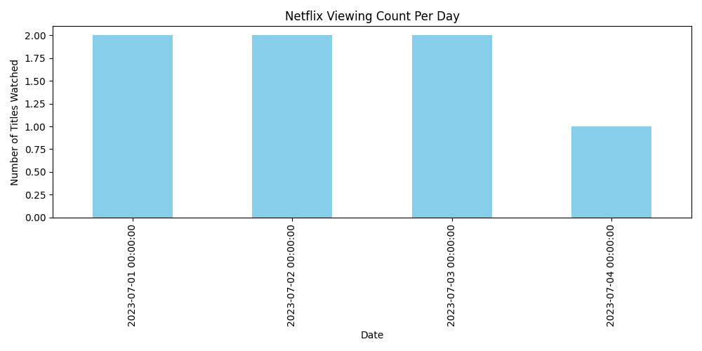

# 🧹 Awesome Python Data Cleaning 📊  
by **adarshXdev**

Turn chaos into clarity.  
This project shows how I take messy CSV data and turn it into clean, useful, and visualized insights — perfect for businesses, analytics, or AI pipelines.

---

## ✅ Key Features

- 🧼 Cleaned **Netflix viewing history** dataset  
- 🔁 Removed duplicates & parsed complex **datetime formats**  
- 📊 Generated **daily viewing bar chart** with Matplotlib  
- 🗂️ Structured in folders for **real-world modularity & reuse**

---

## 📁 Project Structure

| Folder | Description |
|--------|-------------|
| `sample_data/` | Raw Netflix data (CSV) |
| `cleaned_data/` | Final cleaned dataset |
| `scripts/` | Python scripts for cleaning & plotting |
| `plots/` | Auto-generated bar charts (PNG) |

---

## 📊 Sample Output



> A clear visual of how much time was spent watching Netflix day by day.  
> Business-ready. AI-ready. Adarsh-approved. 😎

---

## 🚀 How to Run

```bash
# Step 1: Install dependencies
pip install pandas matplotlib

# Step 2: Run the cleaning + plotting script
python scripts/clean_netflix_data.py
